# SwissTech Inventory System Diagrams

This document explains the system using detailed diagrams in this order:

1. Use Case Diagram
2. Activity Diagrams
3. Sequence Diagrams
4. Class Diagram
5. ER Diagram / Database Design

The diagrams use Mermaid syntax, which can be rendered by GitHub and many Markdown tools.

## 1. Use Case Diagram

The use case diagram shows what each type of user can do in the system.

### Main Actors

- Admin
- Purchase User
- Sale User
- Viewer

### Main Use Cases

- Manage users and roles
- Manage settings
- Manage products
- Manage suppliers/parties
- Manage customers
- Create purchases
- Collect pending purchases
- Refund/cancel purchases
- Create shipments
- Receive shipments
- Create sales
- Perform stock adjustments
- View dashboard
- View reports
- Export reports
- View audit activity

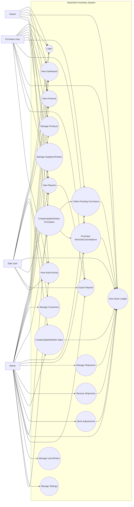

## 2. Activity Diagrams

Activity diagrams show the step-by-step business flow.

### 2.1 New System Setup Activity

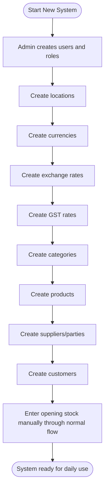

### 2.2 Purchase Entry Activity

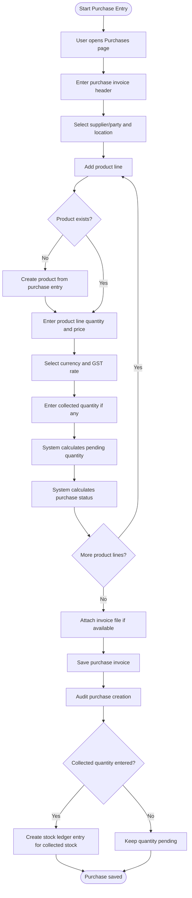

### 2.3 Purchase Collection Activity

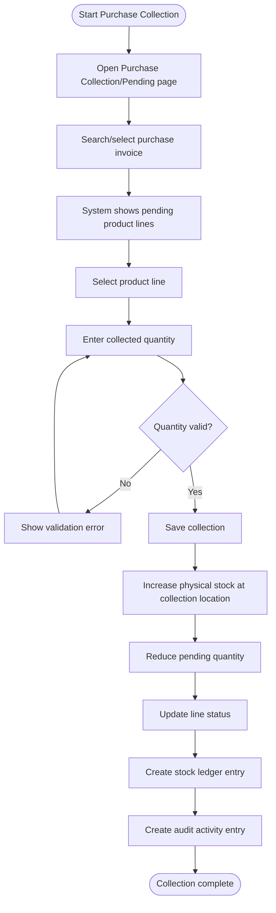

### 2.4 Purchase Refund/Cancellation Activity

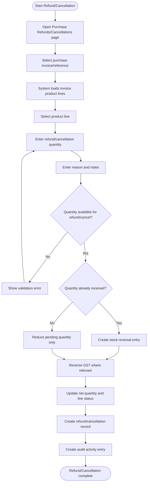

### 2.5 Shipment Activity

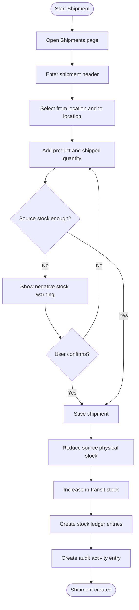

### 2.6 Shipment Receiving Activity

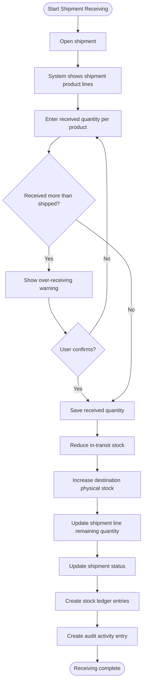

### 2.7 Sales Activity

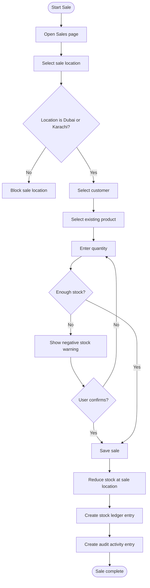

### 2.8 Report Export Activity

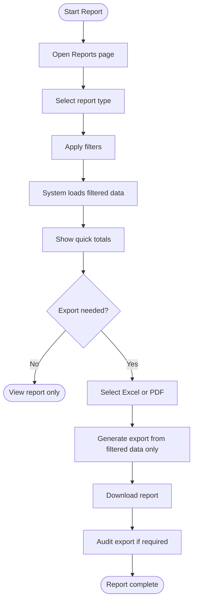

## 3. Sequence Diagrams

Sequence diagrams show how user actions move through the application, service layer, database, stock ledger, and audit system.

### 3.1 Purchase Invoice Creation Sequence

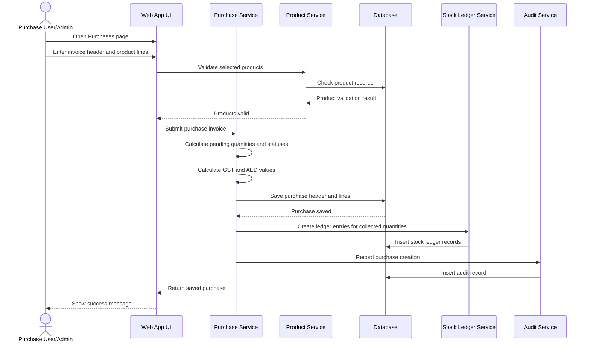

### 3.2 Purchase Refund/Cancellation Sequence

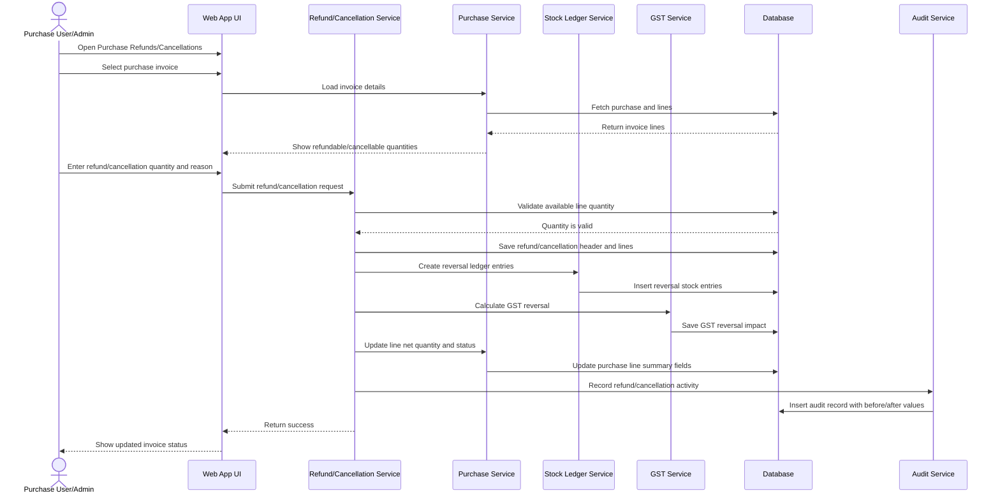

### 3.3 Shipment and Receiving Sequence

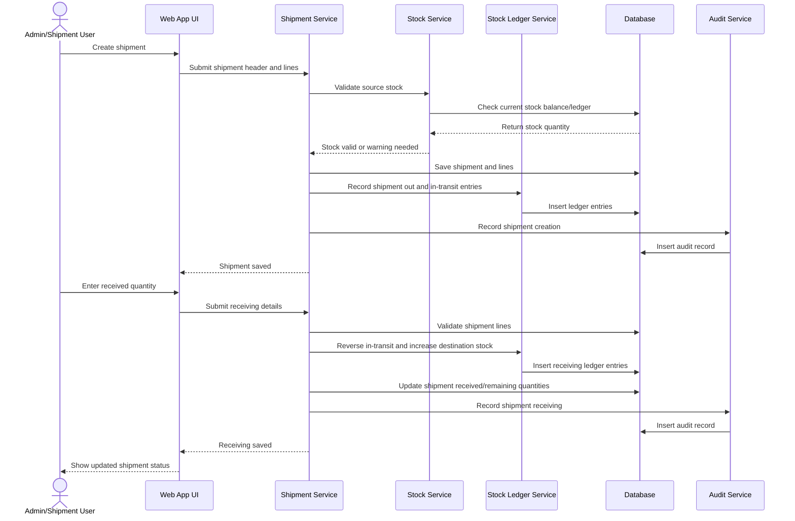

### 3.4 Sale Entry Sequence

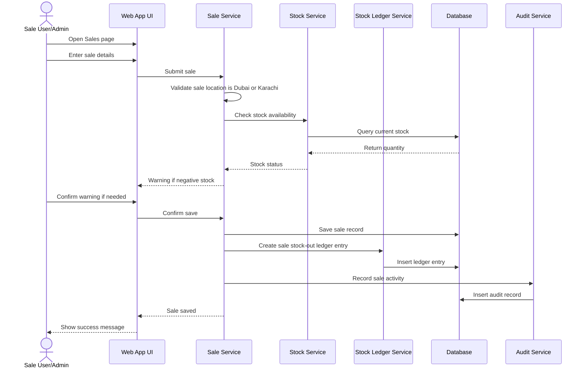

## 4. Class Diagram

The class diagram shows the main business objects and how they relate to each other.

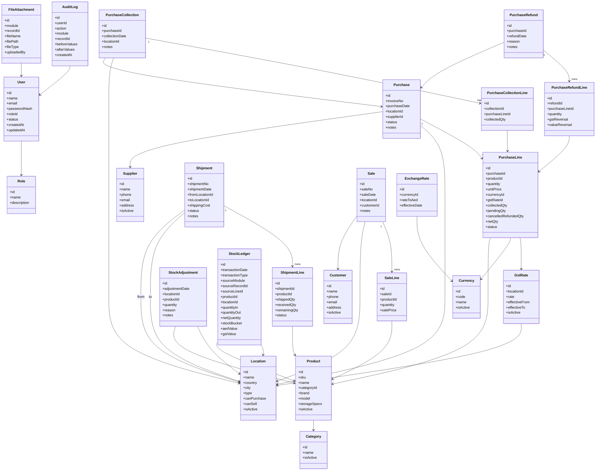

## 5. ER Diagram / Database Design

The ER diagram shows the database tables and their relationships.

### 5.1 Main ER Diagram

```mermaid
erDiagram
    roles ||--o{ users : has
    categories ||--o{ products : groups
    locations ||--o{ purchases : purchase_location
    suppliers ||--o{ purchases : supplies
    purchases ||--o{ purchase_lines : contains
    products ||--o{ purchase_lines : purchased
    currencies ||--o{ purchase_lines : priced_in
    gst_rates ||--o{ purchase_lines : applies

    purchases ||--o{ purchase_collections : collected_by
    locations ||--o{ purchase_collections : collection_location
    purchase_collections ||--o{ purchase_collection_lines : contains
    purchase_lines ||--o{ purchase_collection_lines : collected_line

    purchases ||--o{ purchase_refunds : refunded_by
    purchase_refunds ||--o{ purchase_refund_lines : contains
    purchase_lines ||--o{ purchase_refund_lines : refunded_line

    locations ||--o{ shipments : from_location
    locations ||--o{ shipments : to_location
    shipments ||--o{ shipment_lines : contains
    products ||--o{ shipment_lines : shipped

    customers ||--o{ sales : buys
    locations ||--o{ sales : sale_location
    sales ||--o{ sale_lines : contains
    products ||--o{ sale_lines : sold

    products ||--o{ stock_adjustments : adjusted
    locations ||--o{ stock_adjustments : adjusted_at

    products ||--o{ stock_ledger : ledger_product
    locations ||--o{ stock_ledger : ledger_location
    users ||--o{ audit_logs : performs
    users ||--o{ file_attachments : uploads
    currencies ||--o{ exchange_rates : has
    locations ||--o{ gst_rates : has

    roles {
        bigint id PK
        string name
        text description
        datetime created_at
    }

    users {
        bigint id PK
        bigint role_id FK
        string name
        string email
        string password_hash
        string status
        datetime last_login_at
        datetime created_at
        datetime updated_at
    }

    categories {
        bigint id PK
        string name
        boolean is_active
        datetime created_at
        datetime updated_at
    }

    products {
        bigint id PK
        bigint category_id FK
        string sku
        string name
        string brand
        string model
        string storage_specs
        boolean is_active
        datetime created_at
        datetime updated_at
    }

    locations {
        bigint id PK
        string name
        string country
        string city
        string type
        boolean can_purchase
        boolean can_sell
        boolean is_active
        datetime created_at
        datetime updated_at
    }

    suppliers {
        bigint id PK
        string name
        string phone
        string email
        text address
        text notes
        boolean is_active
        datetime created_at
        datetime updated_at
    }

    customers {
        bigint id PK
        string name
        string phone
        string email
        text address
        text notes
        boolean is_active
        datetime created_at
        datetime updated_at
    }

    currencies {
        bigint id PK
        string code
        string name
        boolean is_active
    }

    exchange_rates {
        bigint id PK
        bigint currency_id FK
        decimal rate_to_aed
        date effective_date
        boolean is_active
    }

    gst_rates {
        bigint id PK
        bigint location_id FK
        decimal rate
        date effective_from
        date effective_to
        boolean is_active
    }

    purchases {
        bigint id PK
        string invoice_no
        date purchase_date
        bigint location_id FK
        bigint supplier_id FK
        string status
        text notes
        bigint created_by FK
        datetime created_at
        datetime updated_at
    }

    purchase_lines {
        bigint id PK
        bigint purchase_id FK
        bigint product_id FK
        decimal quantity
        decimal unit_price
        bigint currency_id FK
        bigint gst_rate_id FK
        decimal collected_qty
        decimal pending_qty
        decimal cancelled_refunded_qty
        decimal net_qty
        decimal gross_value_original
        decimal gst_amount_original
        decimal gst_reversal_original
        string status
    }

    purchase_collections {
        bigint id PK
        bigint purchase_id FK
        date collection_date
        bigint location_id FK
        text notes
        bigint created_by FK
        datetime created_at
    }

    purchase_collection_lines {
        bigint id PK
        bigint collection_id FK
        bigint purchase_line_id FK
        decimal collected_qty
    }

    purchase_refunds {
        bigint id PK
        bigint purchase_id FK
        date refund_date
        string refund_no
        text reason
        text notes
        bigint created_by FK
        datetime created_at
    }

    purchase_refund_lines {
        bigint id PK
        bigint refund_id FK
        bigint purchase_line_id FK
        decimal quantity
        decimal gst_reversal_original
        decimal value_reversal_original
    }

    shipments {
        bigint id PK
        string shipment_no
        date shipment_date
        bigint from_location_id FK
        bigint to_location_id FK
        decimal shipping_cost
        string status
        text notes
        bigint created_by FK
        datetime created_at
    }

    shipment_lines {
        bigint id PK
        bigint shipment_id FK
        bigint product_id FK
        decimal shipped_qty
        decimal received_qty
        decimal remaining_qty
        decimal over_received_qty
        string status
    }

    sales {
        bigint id PK
        string sale_no
        date sale_date
        bigint location_id FK
        bigint customer_id FK
        text notes
        bigint created_by FK
        datetime created_at
    }

    sale_lines {
        bigint id PK
        bigint sale_id FK
        bigint product_id FK
        decimal quantity
        decimal sale_price
    }

    stock_adjustments {
        bigint id PK
        date adjustment_date
        bigint location_id FK
        bigint product_id FK
        decimal quantity
        string adjustment_type
        text reason
        text notes
        bigint created_by FK
        datetime created_at
    }

    stock_ledger {
        bigint id PK
        datetime transaction_at
        string transaction_type
        string source_module
        bigint source_record_id
        bigint source_line_id
        bigint product_id FK
        bigint location_id FK
        decimal quantity_in
        decimal quantity_out
        decimal net_quantity
        string stock_bucket
        decimal aed_value
        decimal gst_value
        text notes
        bigint created_by FK
        datetime created_at
    }

    file_attachments {
        bigint id PK
        string module
        bigint record_id
        string file_name
        string file_path
        string file_type
        bigint uploaded_by FK
        datetime uploaded_at
    }

    audit_logs {
        bigint id PK
        bigint user_id FK
        string action
        string module
        bigint record_id
        json before_values
        json after_values
        string ip_address
        string device_info
        datetime created_at
    }
```

### 5.2 Table Design Notes

#### users

Stores system users. Every business action should be linked to the user who performed it.

Important relationships:

- belongs to role
- creates purchases, sales, shipments, refunds, adjustments, files, and audit logs

#### roles

Stores system roles:

- admin
- purchase user
- sale user
- viewer

#### products

Stores standard Product Master records.

Important rules:

- exact duplicate products should be prevented
- same name with different storage/specs is allowed
- inactive products should not appear in normal entry forms

#### locations

Stores all purchase, stock, sales, and transfer locations.

Important rules:

- Dubai and Karachi can sell
- all current locations can purchase
- Sydney, Melbourne, and Perth remain separate locations

#### purchases and purchase_lines

`purchases` stores invoice-level information.

`purchase_lines` stores product-level purchase details.

One purchase invoice can have many purchase lines.

#### purchase_collections and purchase_collection_lines

These tables track received/collected quantities against purchase lines.

Collection increases physical stock and creates ledger entries.

#### purchase_refunds and purchase_refund_lines

These tables track refund/cancellation events against a selected purchase invoice and specific purchase lines.

Refund/cancellation creates reversal entries and preserves original purchase history.

#### shipments and shipment_lines

These tables track stock transfer between locations.

Shipment lines track shipped, received, remaining, and over-received quantities.

#### sales and sale_lines

These tables track sales from Dubai and Karachi.

Sales reduce stock and create stock ledger entries.

#### stock_ledger

This is the central stock movement table.

All stock-changing actions create ledger entries.

Stock reports should be calculated from this table or from stock balances reconciled against this table.

#### audit_logs

Stores user activity.

Must include create, update, delete, login, settings changes, product creation, party creation, refund/cancellation, and other important actions.

## 6. Recommended Diagram File Split

This combined document is useful for review. If the project grows, these diagrams can later be split into:

- `docs/architecture/use-case-diagram.md`
- `docs/architecture/activity-diagrams.md`
- `docs/architecture/sequence-diagrams.md`
- `docs/architecture/class-diagram.md`
- `docs/architecture/er-diagram.md`

